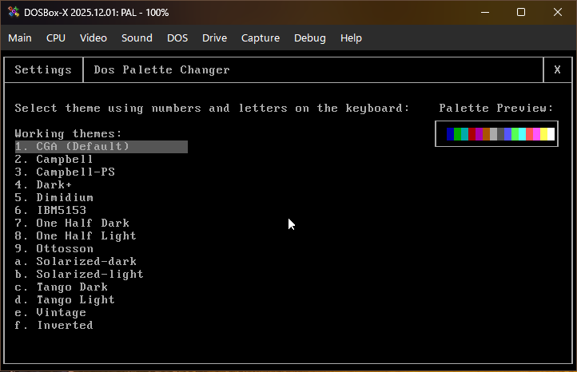
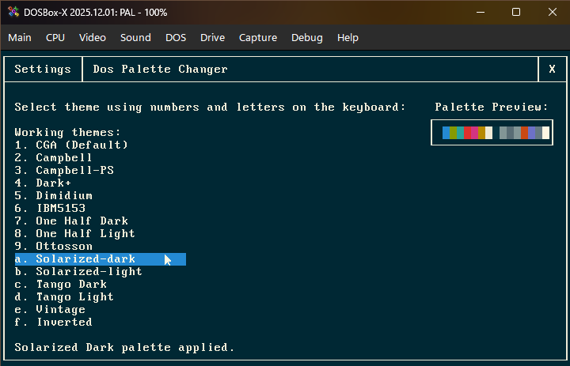
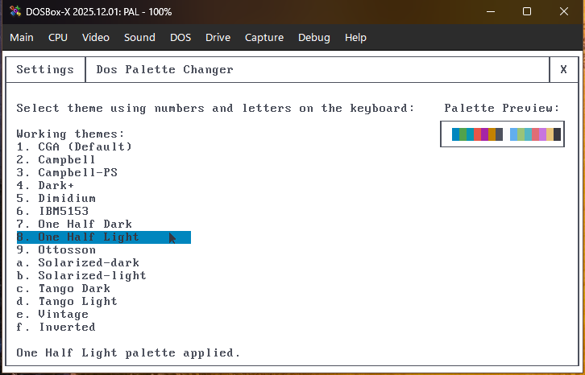
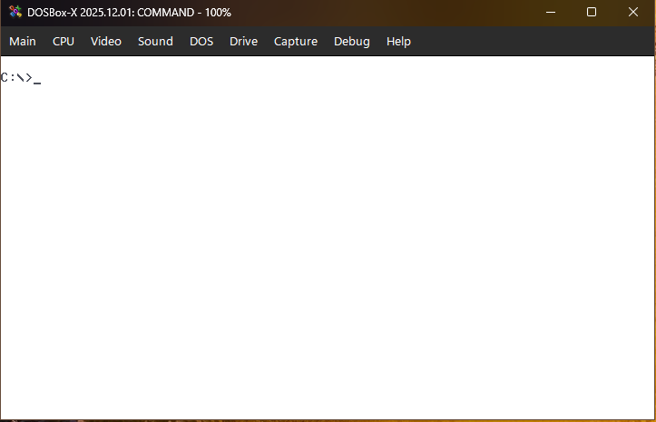

# DOS Palette Changer (PAL.EXE)

DOS Palette Changer is an MS-DOS utility designed to replace the default 16-color VGA palette with modern, retro, and custom color schemes. Inspired by modern terminal aesthetics, for real DOS hardware.Yes, I know that the whole program is made with the help of AI. Because I'm not good at coding at this level, I only know how to design the user interface, and I love a DOS and retro-futuristic aesthetic.

## Features

* **Direct Hardware Manipulation:** Writes directly to the VGA DAC registers (`0x3C8`/`0x3C9`) to rewrite the 16-color palette on the fly.
* **Supports all Text Modes:** Flawlessly adapts its UI and custom mouse boundaries to standard text modes (40x25, 80x25) as well as ultra-dense VESA extended modes (up to 132x60).
* **Robust Mouse Engine:** Features a custom hardware/software mouse cursor. It also Safely detects if a mouse driver (like `CTMOUSE`) is present and fully supports keyboard-only navigation if it isn't.
* **AUTOEXEC.BAT Integration:** Includes a silent command-line mode (`loadconf -s`) to instantly apply your favorite color scheme every time your PC boots up.

Main Screen, running under DOSBox



Solarized-Dark Theme Applied



One Half Light Theme Applied



Settings persists even after exiting the program



## Usage

Simply download the release and extract the files to a folder in your DOS environment.

**Launch the Graphical Interface:**
```bat
C:\> PAL.EXE
```

**Load saved configuration silently and instantly:**
```bat
C:\> PAL.EXE loadconf -s
```

**Apply a theme silently from the command line:**
```bat
C:\> PAL.EXE campbell -s
```

## Known Issues (v1.0)

**UI Flicker on slower systems** - Slight flicker in settings page and hiding of mouse cursor when using very slow CPUs like 8088

## System Requirements

### Recommended
- **OS**: MS-DOS 7.1
- **CPU**: Intel 486 DX2-66 (For smooth performance and hover effects)
- **RAM**: 4 MB
- **Video**: VGA Compatible Graphics Card
- **Input**: Microsoft Compatible Mouse (Serial or PS/2) and Standard Keyboard

### Absolute Minimum
- **OS**: MS-DOS 6.22
- **CPU**: Intel 8088
- **RAM**: 1 MB
- **Video**: VGA Compatible Graphics Card (Supports minimum 40x25 text mode)
- **Input**: Standard Keyboard (Mouse is required for changing settings; otherwise, edit `palconf.txt` manually)

## Tested On

DOS version 6.22 on Real Hardware (Intel i486, 16MB Ram, 2GB CF Card Storage)

DOS version 7.10 on DOSBox-X (Various CPUs, 16MB Ram)
